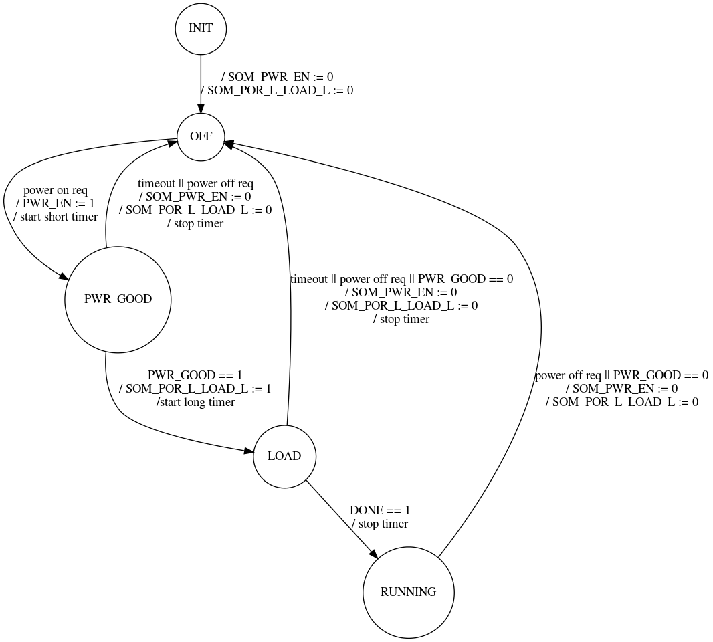

# Chameleon FPGA Power/Boot Sequence State Machine

The FPGA System-on-Module (SOM) has specific requirements for the sequence
of selecting the boot mode, enabling power, and releasing reset. The following
GPIOs are involved:

* `SOM_PWR_EN` (Power Enable) - drive low to turn off the power supplies
	on the SOM, drive high to turn them on.
* `SOM_POR_L_LOAD_L` (Power-on Reset / Load) - this is an active low input
	tied to the cold reset input of the FPGA. Drive low to reset, drive
	high (or let the pull-up resistor pull it high) to release reset.
* `SOM_BOOT_MODE1:0` - refer to the FPGA SOM manual for the boot mode
	settings. These should only be modified when `SOM_PWR_EN` is high and
	`SOM_POR_L_LOAD_L` is low (the SOM is powered up but held in reset).
* `SOM_PWR_GOOD` (Power Good) - high indicates that all power supplies
	are functioning, low indicates there is a problem.
* `SOM_FPGA_DONE` - Configuration signal from the FPGA that, when driven high,
	indicates it has finished loading its configuration and is operating
	now.

## State Machine

The state machine manages the sequence of signals needed to power on the
FPGA and start its boot process, or to power down the FPGA.



Note that the boot mode is not specified in the state machine diagram; these
values are set outside the state machine.

## Implementation Details

The state machine is implemented as a function that takes a pointer to a
state variable, an event, and an output pointer for actions to take.
```
void fpgaboot_run_state_machine(const enum fpga_event event, enum fpga_state *state, uint32 *actions_out);
```
The function may change the `state` variable, and will change the `actions_out`
variable.

`event` encodes only one event at a time, and can be any of the following:

* `SOM_PWR_GOOD` asserted
* `SOM_PWR_GOOD` deasserted
* `SOM_FPGA_DONE` asserted
* `SOM_FPGA_DONE` deasserted
* timer expired

`actions_out` encodes one or more actions, each one represented by a single
bit:

* assert `SOM_PWR_EN`
* deassert `SOM_PWR_EN`
* assert `SOM_POR_L_LOAD_L`
* deassert `SOM_POR_L_LOAD_L`
* start short timer
* start long timer
* stop timer

Note that "short" and "long" are not defined here; the values will have to
be determined later from the datasheets and empirically, but it is expected
that the short timer (to wait from `SOM_PWR_EN` to `SOM_PWR_GOOD`) is on the
order of milliseconds, while the long timer (to wait for the FPGA to finish
configuration and assert `SOM_FPGA_DONE`) could be hundreds of milliseconds
or more.

There is an API to send the "power on" and "power off" requests to the
state machine. Another API call allows setting the `SOM_BOOT_MODE`
signals indirectly, by setting variables that the state machine will use
only when it is handling a "power on" request.

The state machine runs in a separate thread. A `SYS_INIT` function configures
the GPIOs, sets up a timer and a message queue, initializes the state machine,
and creates a thread for the state machine. The thread receives messages on
the queue, converts them into events, and calls the state machine function
with that information.

The state machine can be unit tested by making direct calls to the state
machine function and observing the resulting outputs. While the state will
be exposed to the unit tests (since it is part of the struct), the tests
will not read the state to determine if a test passed. The only writing of
the state will be in test case setup, to reset the state machine to a known
initialization state.
